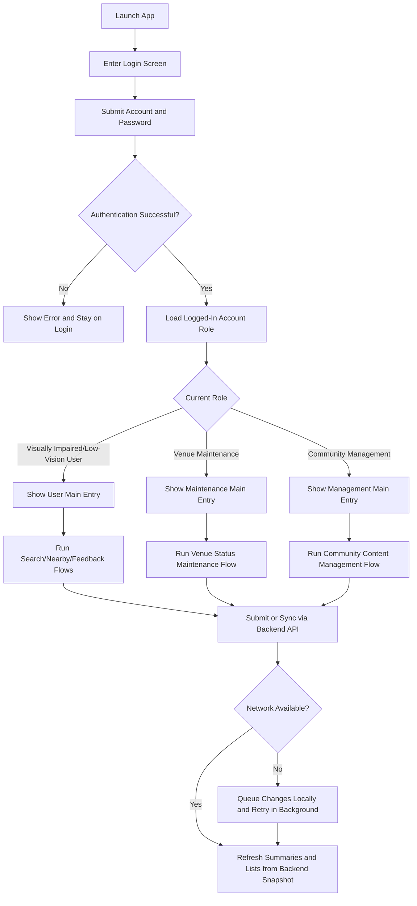
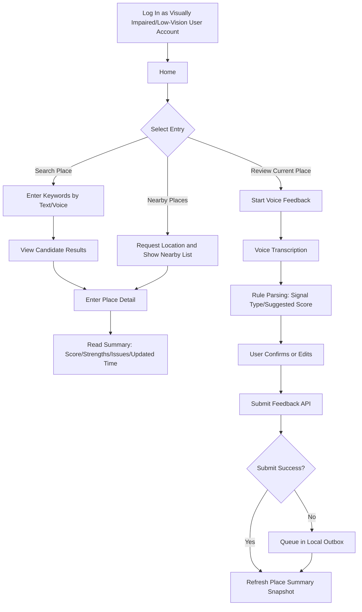
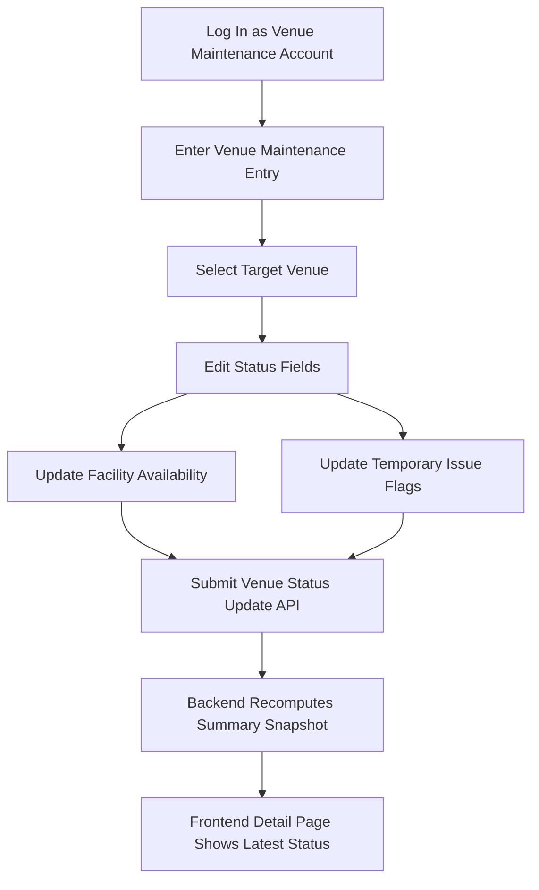
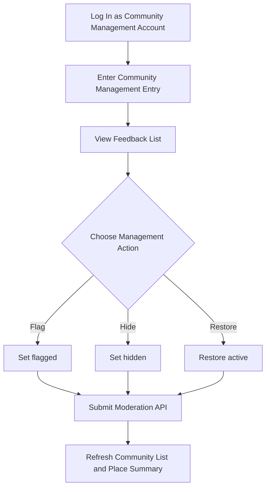

# Luma Role Features and Flowcharts

## 1. Document Information
- Document Name: Luma Role Features and Flowcharts
- Applicable Version: Luma iOS MVP (account-and-password authentication mode)
- Updated On: 2026-03-10

## 2. Role Definitions
- Visually Impaired/Low-Vision User Account: Core MVP user role, responsible for search, viewing, and feedback.
- Venue Maintenance Account: Authenticated operational role, responsible for maintaining venue status fields.
- Community Management Account: Authenticated moderation role, responsible for managing the status of community feedback content.

## 3. Role Feature List

| Feature Module | Visually Impaired/Low-Vision User Account | Venue Maintenance Account | Community Management Account |
|---|---|---|---|
| Account Login (email/username + password) | Supported | Supported | Supported |
| First-Time Tutorial Playback | Supported | Supported | Supported |
| Place Search (Text/Voice) | Supported | Supported | Supported |
| View Place Summary | Supported | Supported | Supported |
| View Recent Reviews | Supported | Supported | Supported |
| Submit Voice Feedback | Supported | Supported | Not Supported |
| View Nearby Places | Supported | Supported | Supported |
| Maintain Venue Status (facility availability, temporary issues) | Not Supported | Supported | Read-only |
| Community Feedback Management (flag/hide/restore) | Not Supported | Read-only | Supported |
| Local Data Management (refresh sync/clear cache/retry outbox) | Read-only | Supported | Supported |

## 4. Global Flowchart (Account-and-Password Authentication + Permission Routing)

## 5. Visually Impaired/Low-Vision User Flowchart

## 6. Venue Maintenance Account Flowchart

## 7. Community Management Account Flowchart

## 8. Key Interaction and Permission Rules
- Permissions are granted only after successful account-and-password authentication and are determined by the logged-in account role (not by preset demo accounts).
- Visible page does not mean executable actions: roles without permission are read-only and cannot submit changes.
- All key state transitions (save success, insufficient permissions, operation failure) require voice announcements.
- All role flows use backend APIs as source of truth, with local cache/outbox fallback when offline.

## 9. Review and Acceptance Recommendations
- Verify login and permission routing by signing in with three different account credentials (page entries, button executability changes).
- Verify that "read-only roles" cannot perform restricted actions.
- Verify that backend state, cached state, and UI state remain consistent after actions by all three roles.
- Verify under VoiceOver that the login entry and key buttons are fully operable.
